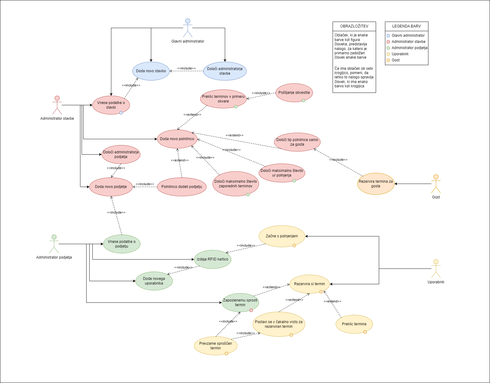

# Diplomska naloga - uporabniške zgodbe

<b>1. Glavni administrator</b>

## 1. Določi administratorja stavbe

> **Prioriteta:** 1
>  **Ocena:** 1
>  **Zgodba:** Glavni administrator lahko kreira administratorja stavbe in mu povezavo za registracijo pošlje na e-mail.
>  **Opombe:** /
>  **Sprejemni testi:** Administratorju stavbe določi le email.

## 2. Doda novo stavbo

> **Prioriteta:** 1
> ** Ocena:** 2
> ** Zgodba:** Glavni administrator lahko kreira in upravlja s stavbo.
> ** Opombe:** Glavni administrator je le en.
> ** Sprejemni testi:** Za kreiranje stavbe so pomembni: Naslov stavbe, poštna številka, administrator stavbe in podatki o njej.

## 3. Vnese podatke o stavbi
> **Prioriteta:** 2
> ** Ocena:** 2
> ** Zgodba:** Administrator stavbe lahko kadarkoli spremeni podatke o stavbi.
> ** Opombe:** /
> ** Sprejemni testi:** Urejanje polnilnic, podjetij in podatkov o stavbi

<b>2. Administrator stavbe</b>

## 1. Se registrira

> **Prioriteta:** 1
> ** Ocena:** 1
> ** Zgodba:** Administrator stavbe na mail dobi podatke za prijavo v aplikacijo. Ob prvi prijavi, ga sistem pozove v spremembo gesla.
> ** Opombe:** Za uporabo aplikacije, si mora geslo spremeniti.
> ** Sprejemni testi:** Geslo mora biti dovolj zahtevno (vsaj 6 znakov, vsaj ena velika črka in vsaj 2 števili in en znak).

## 2. Vnese podatke o stavbi

> **Prioriteta:** 2
> ** Ocena:** 2
> ** Zgodba:** Administrator stavbe lahko kadarkoli spremeni podatke o stavbi.
> ** Opombe:** /
> ** Sprejemni testi:** Urejanje polnilnic, podjetij in podatkov o stavbi

## 3. Doda novo polnilnico

> **Prioriteta:** 2
> ** Ocena:** 2
> ** Zgodba:** Administrator stavbe lahko kadarkoli doda polnilnico.
> ** Opombe:** /
> ** Sprejemni testi:** Polnilnica vsebuje podatke o moči, lokaciji, maks število zaporednih terminov, maks ur polnjenja in kateremu podjetju pripada. Ustvari lahko tudi polnilnico ki pripada le gostu (uporabniku, ki ni registriran).

## 4. Preklic terminov v primeru okvare

> **Prioriteta:** 2
> ** Ocena:** 2
> ** Zgodba:** Administrator stavbe lahko kadarkoli zaradi tehničnih ali drugih napak prekliče termine na katerikoli polnilnici.
> ** Opombe:** /
> ** Sprejemni testi:** Po preklicu vsi, ki so imeli rezervacijo dobijo obvestilo.

## 5. Določi administratorja podjetja

> **Prioriteta:** 1
>  **Ocena:** 4
>  **Zgodba:** Administrator stavbe lahko kreira administratorja podjetja in mu povezavo za registracijo pošlje na e-mail.
>  **Opombe:** /
>  **Sprejemni testi:** Administratorju podjetja določi le email.

## 6. Doda novo podjetje

> **Prioriteta:** 1
> ** Ocena:** 2
> ** Zgodba:** Administrator stavbe lahko upravlja s podjetjem (s polnilnicami, ki pripadajo).
> ** Opombe:** Stavba ima le enega administratorja stavbe.
> ** Sprejemni testi:** Za kreiranje stavbe so pomembni: Nadstropje/soba podjetja in podatki o polnilnicah.

## 7. Zaposlenemu sprosti termin

> **Prioriteta:** 5
> ** Ocena:** 3
> ** Zgodba:** Administrator stavbe lahko kateremu koli uporabniku v sili sprosti termin.
> ** Opombe:** /
> ** Sprejemni testi:** Uporabnik je o sprostitvi obveščen.

<b>3. Administrator podjetja</b>

## 1. Se registrira

> **Prioriteta:** 1
> ** Ocena:** 1
> ** Zgodba:** Administrator podjetja na mail dobi podatke za prijavo v aplikacijo. Ob prvi prijavi, ga sistem pozove v spremembo gesla.
> ** Opombe:** Za uporabo aplikacije, si mora geslo spremeniti.
> ** Sprejemni testi:** Geslo mora biti dovolj zahtevno (vsaj 6 znakov, vsaj ena velika črka in vsaj 2 števili in en znak).

## 2. Vnese podatke o podjetju

> **Prioriteta:** 1
> ** Ocena:** 2
> ** Zgodba:** Administrator podjetja lahko upravlja s podjetjem (s polnilnicami, ki pripadajo).
> ** Opombe:** Podjetje ima le enega administratorja podjetja.
> ** Sprejemni testi:** Spreminja lahko: Nadstropje/soba podjetja, maks število zaporednih terminov, maks ur polnjenja.

## 3. Doda novega uporabnika

> **Prioriteta:** 1
>  **Ocena:** 4
>  **Zgodba:** Administrator podjetja lahko kreira uporabnika in mu povezavo za registracijo pošlje na e-mail.
>  **Opombe:** /
>  **Sprejemni testi:** Uporabniku določi le email.

## 4. Zaposlenemu sprosti termin

> **Prioriteta:** 1
>  **Ocena:** 4
>  **Zgodba:** Administrator podjetja, lahko kadarkoli sprosti termin.
>  **Opombe:** /
>  **Sprejemni testi:** Uporabnik z rezerviranim terminom, dobi email o spremembi.

## 5. Izdaja RFID kartico

> **Prioriteta:** 1
>  **Ocena:** 4
>  **Zgodba:** Administrator podjetja, uporabniku generira rfid kartico
>  **Opombe:** /
>  **Sprejemni testi:** Uporabnik z rfid kartico lahko uporablja polnilnico.

## 6. Določi maksimalno število ur polnjenja

> **Prioriteta:** 1
>  **Ocena:** 3
>  **Zgodba:** Adminstrator podjetja, lahko svojim polnilnicam spremeni maksimalno število ur polnjenja.
>  **Opombe:** /
>  **Sprejemni testi:** Uporabniki ne morajo polniti več kot maksimum časa polnilnice.

## 7. Določi maksimalno število zaporednih terminov

> **Prioriteta:** 1
>  **Ocena:** 3
>  **Zgodba:** Adminstrator podjetja, lahko svojim polnilnicam spremeni maksimalno število zaporednih terminov.
>  **Opombe:** /
>  **Sprejemni testi:** Uporabniki lahko rezervirajo le x zaporednih terminov.

## 8. Preklic terminov v primeru okvare

> **Prioriteta:** 2
> ** Ocena:** 2
> ** Zgodba:** Administrator podjetja lahko kadarkoli zaradi tehničnih ali drugih napak prekliče termine zaposlnih na katerikoli polnilnici, ki pripada podjetju.
> ** Opombe:** /
> ** Sprejemni testi:** Po preklicu vsi, ki so imeli rezervacijo dobijo obvestilo.

<b>4. Uporabnik</b>

## 1. Se registrira

> **Prioriteta:** 1
> ** Ocena:** 1
> ** Zgodba:** Uporabnik na mail dobi podatke za prijavo v aplikacijo. Ob prvi prijavi, ga sistem pozove v spremembo gesla.
> ** Opombe:** Za uporabo aplikacije, si mora geslo spremeniti.
> ** Sprejemni testi:** Geslo mora biti dovolj zahtevno (vsaj 6 znakov, vsaj ena velika črka in vsaj 2 števili in en znak).

## 2. Rezervira si termin

> **Prioriteta:** 1
> ** Ocena:** 1
> ** Zgodba:** Uporabnik si lahko rezervira termin.
> ** Opombe:** Če je termin zasede, ga aplikacija doda v čakalno vrsto.
> ** Sprejemni testi:** Termini morajo zadoščati omejitvam polnilnice (št. zaproednih rezervacij)

## 3. Preklic termina

> **Prioriteta:** 1
> ** Ocena:** 1
> ** Zgodba:** Uporabnik si lahko sprosti termin.
> ** Opombe:** /
> ** Sprejemni testi:** Termin dobi naslednji v čakalni vrsti.

## 4. Prevzame sproščen termin

> **Prioriteta:** 1
> ** Ocena:** 1
> ** Zgodba:** Uporabnik lahko v primeru odpovedu drugega uporabnika termin prevzame.
> ** Opombe:** Uporabnik mora biti v času sprostitve v čakalni vrsti za termin.
> ** Sprejemni testi:** O prevzemu termina je obveščen preko emaila.

## 5. Začne s polnjenjem

> **Prioriteta:** 1
> ** Ocena:** 1
> ** Zgodba:** Uporabnik s pomočjo RFID kartice začne s polnjenjem.
> ** Opombe:** /
> ** Sprejemni testi:** Kartica se uporabi kot identifikacija uporabnika.

<b>5. Gost</b>

## 1. Rezervira termina za goste

> **Prioriteta:** 1
> ** Ocena:** 1
> ** Zgodba:** Gost si lahko rezervira termin.
> ** Opombe:** Če je termin zasede, ga aplikacija doda v čakalno vrsto. Polnilnica za goste je posebaj in je vidna brez prijave.
> ** Sprejemni testi:** Termini morajo zadoščati omejitvam polnilnice (št. zaproednih rezervacij)

## 2. Začne s polnjenjem

> **Prioriteta:** 1
> ** Ocena:** 1
> ** Zgodba:** Gost z identifikacijsko kodo začne polnjenje.
> ** Opombe:** /
> ** Sprejemni testi:** Identifikacijska koda se uporabi za identifikacijo uporabnika.

## 3. Preklic termina

> **Prioriteta:** 1
> ** Ocena:** 1
> ** Zgodba:** Gost si lahko sprosti termin.
> ** Opombe:** /
> ** Sprejemni testi:** Termin dobi naslednji v čakalni vrsti.

## 4. Prevzame sproščen termin

> **Prioriteta:** 1
> ** Ocena:** 1
> ** Zgodba:** Gost lahko v primeru odpovedu drugega gosta termin prevzame.
> ** Opombe:** Gost mora biti v času sprostitve v čakalni vrsti za termin.
> ** Sprejemni testi:** O prevzemu termina je obveščen preko emaila.

# Diplomska naloga - Diagram uporab

